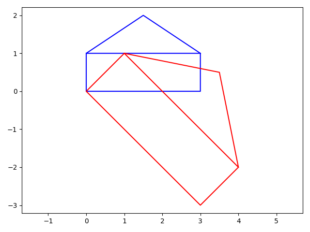

# Matrix fun - Assignment 3
Down below you can see all the results.
There is both a python file version and a notebook version.
 
 
Its easier to read the code and the results in the notebook version than this readme.
 
 
Click [here](mainNoteBook.ipynb) to check notebook version.
# Task 1

<b>A</b>: 
[3 2]
 
&nbsp;&nbsp;&nbsp;&nbsp;[1 6]
 
 
<b>B:</b>
[-1 3]
 
&nbsp;&nbsp;&nbsp;&nbsp;&nbsp;[4 8]
 
 
<b>C:</b>
[0 20]
 
&nbsp;&nbsp;&nbsp;&nbsp;&nbsp;[16 56]
 
 
With * instead of @
 
[-3 4]
 
[6 48]
 
The difference between * and @ is that with * it takes the spot of each matrix and takes the same spot from the other  matrix and multiplies example: A[3]*B[-1]
 
<b>D:</b>
 
[0 16]
 
[20 56]
 
<b>E:</b>
AB^T is the same as A^T@B^T 
 
<b>F:</b>
[3 1]
 
&nbsp;&nbsp;&nbsp;&nbsp;&nbsp;[2 6]
 
<b>F:</b>
[10 12]
 
&nbsp;&nbsp;&nbsp;&nbsp;&nbsp;[12 40]

# Task 2
<b>A:</b>
[5 8]
 
&nbsp;&nbsp;&nbsp;&nbsp;&nbsp;[9 14]
 
<b>B:</b>
[8 5]
 
&nbsp;&nbsp;&nbsp;&nbsp;&nbsp;[18 11]
 

# Task 3
<b>A:</b>
[2 -1]
 
&nbsp;&nbsp;&nbsp;&nbsp;&nbsp;[-3 2]
 
<b>B:</b>
[-2 -1]
 
&nbsp;&nbsp;&nbsp;&nbsp;&nbsp;[1.5  -0.5]
 
<b>C:</b>
[1 0]
 
&nbsp;&nbsp;&nbsp;&nbsp;&nbsp;[0  1]
 
<b>D:</b>
[1 0]
 
&nbsp;&nbsp;&nbsp;&nbsp;&nbsp;[0  1]
 
<b>E:</b>
[1 0]
 
&nbsp;&nbsp;&nbsp;&nbsp;&nbsp;[0  1]
 
<b>F:</b>
[1 0]
 
&nbsp;&nbsp;&nbsp;&nbsp;&nbsp;[0  1]
 

# Task 4
<b>A:</b>
 

